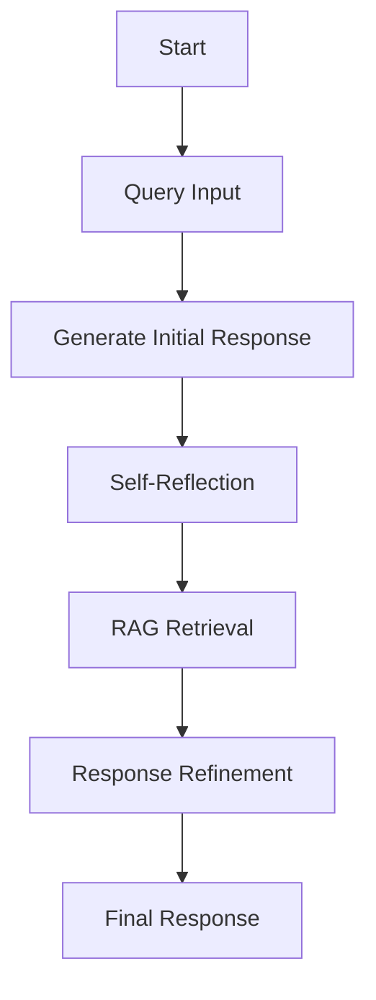
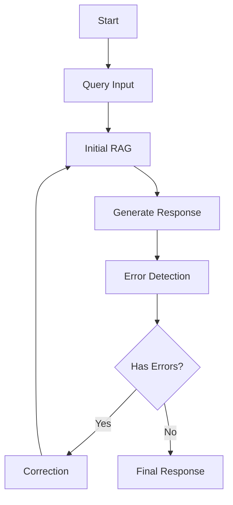
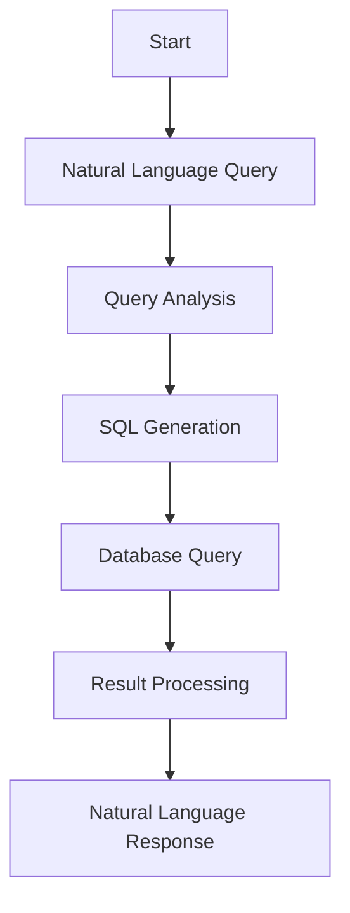
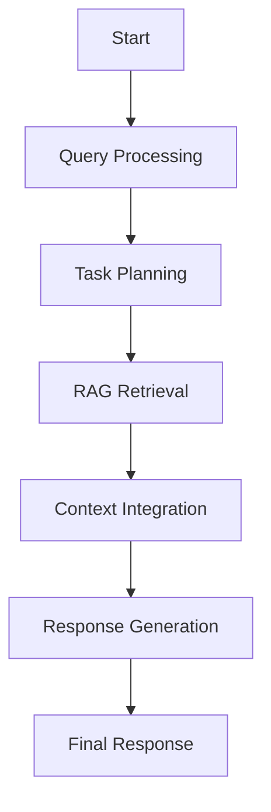
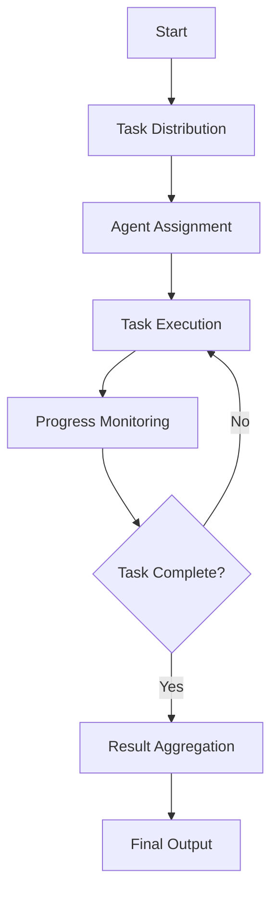
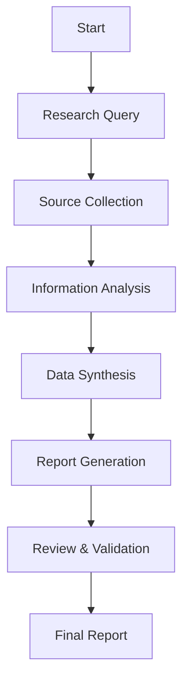
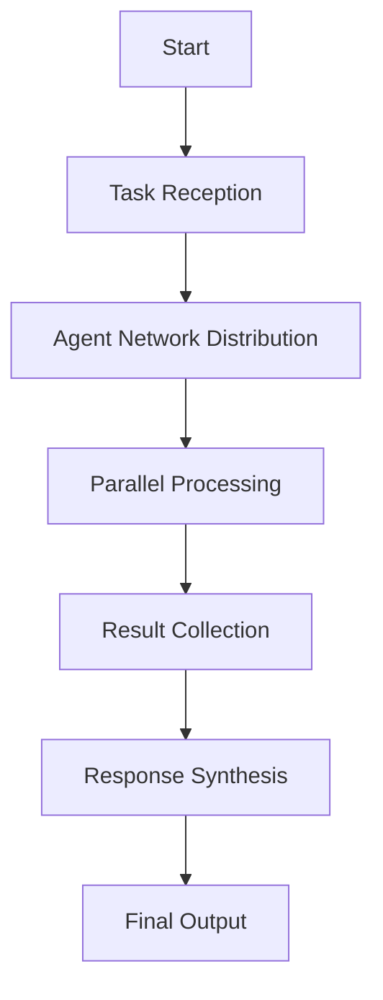
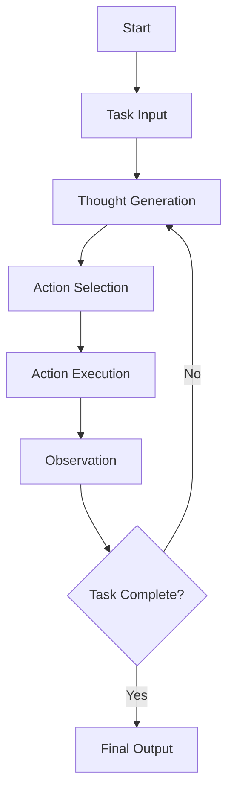
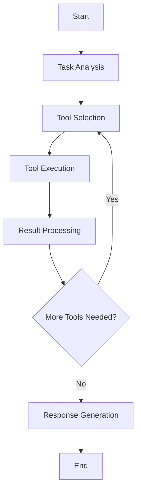

# LangGraph Agent Implementation Project!

## Overview

This project showcases different implementations of LangGraph-based agents and RAG (Retrieval Augmented Generation) tools, demonstrating various approaches to building intelligent conversational systems.

## Agent Implementations

### RAG Agents

| Type | Description | Category |
|------|-------------|----------|
| 🤖 Self RAG | [Enhanced RAG with adaptive retrieval](LangGraph_1/types_RAG-with-LangGraph/self_rag.ipynb) | 📚 RAG |
| 🔄 Corrective RAG | [Improved accuracy with correction mechanisms](LangGraph_1/types_RAG-with-LangGraph/corrective_rag.ipynb) | 📚 RAG |
| 💾 SQL Agent | [Database interactions and processing](LangGraph_1/types_RAG-with-LangGraph/sql_agent.ipynb) | 🗃️ Database |
| 🎯 Agentic RAG | [Advanced RAG capabilities](LangGraph_1/types_RAG-with-LangGraph/Agentic_rag.ipynb) | 📚 RAG |
| 🎫 Customer Support | [Autonomous support system](LangGraph_1/types_RAG-with-LangGraph/autonomous_Customer_support_agent.ipynb) | 💁 Support |

### Multi-Agent Systems

| Type | Description | Category |
|------|-------------|----------|
| 👥 Multi-Agent System | [Coordinated supervisor system](LangGraph_1/Multi-Agent-Systems/multi_agent_supervisor.ipynb) | 🤝 Multi-agent |
| 📊 Research Analyst | [Research and analysis system](LangGraph_1/Multi-Agent-Systems/multiagent-research_analyst.ipynb) | 🤝 Multi-agent |
| 🌐 Network Agent | [Networked agent system](LangGraph_1/Multi-Agent-Systems/network_multiagent_system.ipynb) | 🤝 Multi-agent |
| 👨‍💼 Supervisor Agent | [Core supervisor implementation](LangGraph_1/Multi-Agent-Systems/supervisor_agent.ipynb) | 🤝 Multi-agent |

### Core Agents

| Type | Description | Category |
|------|-------------|----------|
| 🤔 ReAct Agent | [ReAct pattern implementation](ReAct_Agent.ipynb) | ⚡ Core |
| 🔧 Tool Agent | [Tool-based agent implementation](tool_agent.ipynb) | ⚡ Core |

## Project Structure

```plaintext
.
├── LangGraph_1/
│   ├── types_RAG-with-LangGraph/
│   │   ├── self_rag.ipynb
│   │   ├── corrective_rag.ipynb
│   │   ├── sql_agent.ipynb
│   │   ├── Agentic_rag.ipynb
│   │   └── autonomous_Customer_support_agent.ipynb
│   ├── Multi-Agent-Systems/
│   │   ├── multi_agent_supervisor.ipynb
│   │   ├── multiagent-research_analyst.ipynb
│   │   ├── multiagent.ipynb
│   │   ├── network_multiagent_system.ipynb
│   │   ├── network.ipynb
│   │   └── supervisor_agent.ipynb
│   └── human-in-loop.ipynb
├── ReAct_Agent.ipynb
├── tool_agent.ipynb
└── requirements.txt
```

## Features

### 1. RAG Implementations

- **Self-RAG**: Enhanced retrieval with self-reflection
- **Corrective RAG**: Real-time correction mechanisms
- **SQL RAG**: Database interaction capabilities
- **Agentic RAG**: Advanced agent-based RAG
- **Customer Support RAG**: Knowledge base integration

### 2. Multi-Agent Systems

- Supervisor-based architecture
- Research and analysis capabilities
- Networked agent communication
- Task delegation and management

### 3. Core Implementations

- ReAct pattern implementation
- Tool-based agent systems
- Human-in-the-loop processing

## Technology Stack

- **LangGraph**: Core framework for agent workflows
- **LangChain**: LLM integration and tools
- **Jupyter**: Interactive notebook environment
- **SQLite**: Database for SQL agent demonstrations

## Getting Started

1. Install dependencies:

    ```bash
    pip install -r requirements.txt
    ```

2. Set up environment variables:

    ```bash
    # Create .env file with your API keys
    OPENAI_API_KEY=your_key
    LANGCHAIN_API_KEY=your_key
    ```

3. Run the Jupyter notebooks:

    ```bash
    jupyter notebook
    ```

## Development Best Practices

### 1. Agent Design

- Clear node separation
- Proper error handling
- Modular design patterns

### 2. RAG Implementation

- Optimize chunk sizes
- Configure retrieval parameters
- Implement validation

### 3. State Management

- Type-safe transitions
- Proper validation
- Error handling

## Contributing

Contributions welcome for:

- New agent implementations
- RAG enhancements
- Documentation improvements
- Bug fixes

## License

This project is licensed under the MIT License - see the LICENSE file for details.

## Agent Workflow Architectures

### RAG Agent Workflows

#### Self RAG Workflow



#### Corrective RAG Workflow



#### SQL Agent Workflow



#### Agentic RAG Workflow



### Multi-Agent System Workflows

#### Supervisor Agent Workflow



#### Research Analyst Workflow



#### Network Agent Workflow



### Core Agent Workflows

#### ReAct Agent Workflow



#### Tool Agent Workflow


