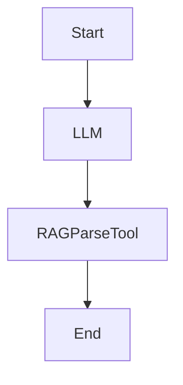

# LangGraph Agent Implementation Project

## Overview

This project showcases different implementations of LangGraph-based agents and RAG (Retrieval Augmented Generation) tools, demonstrating various approaches to building intelligent conversational systems.

## Code Files

| Agent Type | Implementation Details | Category |
|------------|----------------------|-----------|
| 🤖 Self RAG | [Enhanced RAG with adaptive retrieval and self-reflection](LangGraph_1/types_RAG-with-LangGraph/self_rag.ipynb) | 📚 RAG |
| 🔄 Corrective RAG | [Improved accuracy with real-time correction mechanisms](LangGraph_1/types_RAG-with-LangGraph/corrective_rag.ipynb) | 📚 RAG |
| 💾 SQL Agent | [Database interactions and query processing](LangGraph_1/types_RAG-with-LangGraph/sql_agent.ipynb) | 🗃️ Database |
| 🎯 Agentic RAG | [Advanced RAG with agentic capabilities](LangGraph_1/types_RAG-with-LangGraph/Agentic_rag.ipynb) | 📚 RAG |
| 🎫 Customer Support | [Autonomous customer support with knowledge base](LangGraph_1/types_RAG-with-LangGraph/autonomous_Customer_support_agent.ipynb) | 💁 Support |
| 🏥 Insurance Advisor | [Virtual insurance agent with policy recommendations](LangGraph_1/Advisr/virtual_insurance_agent.ipynb) | 🏢 Domain-specific |
| 👥 Multi-Agent System | [Coordinated system with supervisor](LangGraph_1/Multi-Agent-Systems/multi_agent_supervisor.ipynb) | 🤝 Multi-agent |
| 📊 Research Analyst | [Multi-agent system for research and analysis](LangGraph_1/Multi-Agent-Systems/multiagent-research_analyst.ipynb) | 🤝 Multi-agent |
| 🌐 Network Agent | [Networked multi-agent system](LangGraph_1/Multi-Agent-Systems/network_multiagent_system.ipynb) | 🤝 Multi-agent |
| 👨‍💼 Supervisor Agent | [Core supervisor implementation](LangGraph_1/Multi-Agent-Systems/supervisor_agent.ipynb) | 🤝 Multi-agent |
| 📊 Spreadsheet Agent | [AI-powered spreadsheet operations](LangGraph_1/Spreadsheet_AIAgent/spreadsheet-AIAgent.ipynb) | 🛠️ Tool-specific |
| 👁️ Vision Agent | [Web browsing with visual processing](LangGraph_1/Vision_enabled_Agent/web_browsing_agent.ipynb) | 👀 Vision |
| 💬 Chatbot | [Advanced conversational agent](LangGraph_1/Chatbot/chatbot.ipynb) | ⚡ Core |
| 🤔 ReAct Agent | [ReAct pattern implementation](ReAct_Agent.ipynb) | ⚡ Core |
| 📝 Report Generator | [Structured report generation](structured_report_generation.ipynb) | 📄 Document |
| 🔧 Tool Agent | [Tool-based agent implementation](tool_agent.ipynb) | ⚡ Core |

## Project Structure

### Core Components

```plaintext
├── LangGraph_1/
│   ├── types_RAG-with-LangGraph/
│   │   ├── self_rag.ipynb         # Self-reflective RAG implementation
│   │   ├── corrective_rag.ipynb   # Corrective RAG implementation
│   │   └── sql_agent.ipynb        # SQL-based agent implementation
│   ├── Multi-Agent-Systems/       # Various multi-agent implementations
│   ├── Advisr/                    # Insurance advisor agent implementation
│   ├── Chatbot/                   # Chatbot implementation
│   ├── Spreadsheet_AIAgent/       # Spreadsheet operations agent
│   └── Vision_enabled_Agent/      # Web browsing with vision capabilities
├── data/                         # Data resources
└── new_data/                     # Additional data resources
```

## Features

### 1. RAG Implementations

- **Self-RAG**: Enhanced LLM quality through adaptive retrieval and self-reflection
- **Corrective RAG**: Improved accuracy with real-time correction mechanisms
- **Parse RAG Tool**: Specialized parsing capabilities for structured information retrieval

### 2. Multi-Agent Systems

- Supervisor-based architecture
- Agent coordination and communication
- Task delegation and management
- Error handling mechanisms

### 3. Special Purpose Agents

- Insurance advisor agent (Advisr)
- Customer support agent
- SQL query agent
- Document analysis agent

## Technology Stack

- **LangGraph**: Core framework for agent workflows
- **LangChain**: Integration with language models and tools
- **Google AI**: Integration with Google's AI models
- **Vector Stores**: ChromaDB for document storage and retrieval

## Agent Workflow Architecture



## Key Features of LangGraph Implementation

1. **State Management**

   - Shared data structures
   - Type-safe state transitions
   - Memory persistence

2. **Node Architecture**

   - Function-based nodes
   - Conditional routing
   - Error handling

3. **Workflow Control**

   - Sequential processing
   - Parallel execution
   - Conditional branching

## Getting Started

1. Install dependencies:

```bash
pip install -r requirements.txt
```

2. Set up environment variables:

```bash
GOOGLE_API_KEY=your_key
GROQ_API_KEY=your_key
LANGSMITH_API_KEY=your_key
```

3. Run the Jupyter notebooks to explore different implementations

## Development Best Practices

1. **Agent Design**

   - Use clear node separation
   - Implement proper error handling
   - Design for modularity

2. **RAG Implementation**

   - Configure appropriate chunk sizes
   - Optimize retrieval parameters
   - Implement proper validation

3. **State Management**

   - Use typed dictionaries
   - Implement proper state validation
   - Handle edge cases

## Contributing

Feel free to contribute to this project by:

- Adding new agent implementations
- Improving existing RAG tools
- Enhancing documentation
- Fixing bugs

## License

This project is licensed under the MIT License - see the LICENSE file for details.
